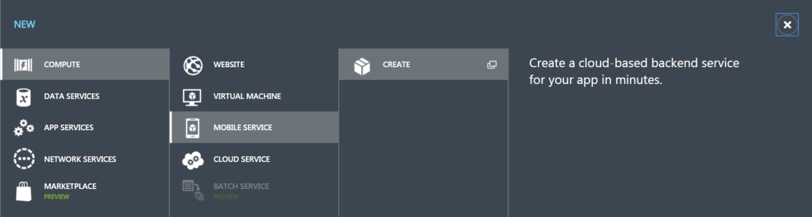
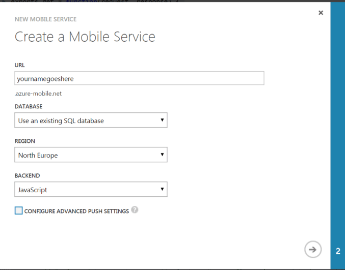
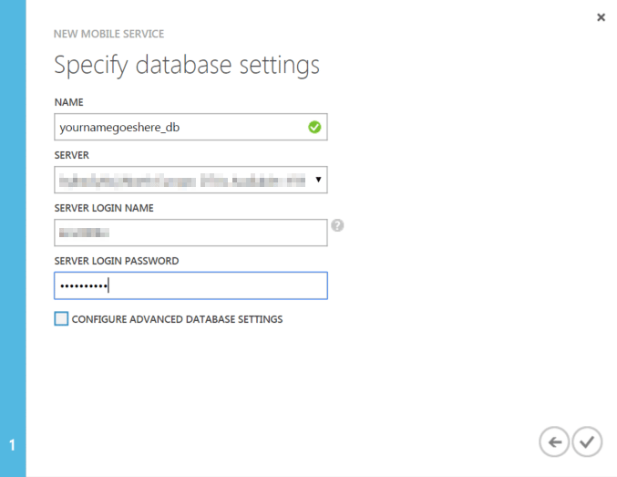
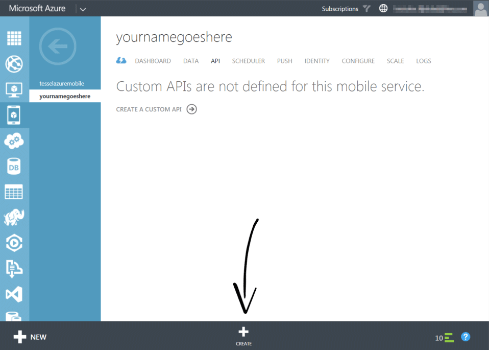
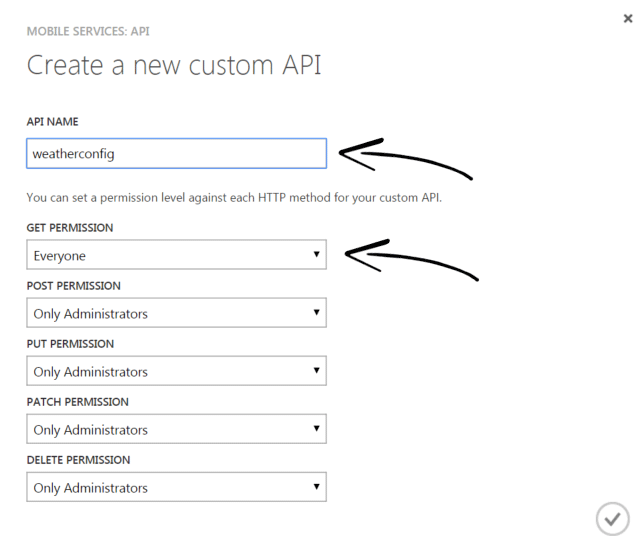
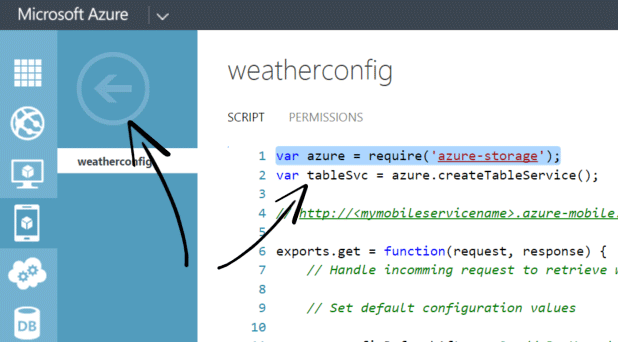
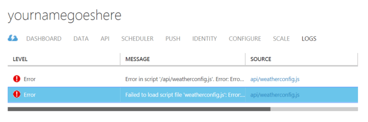
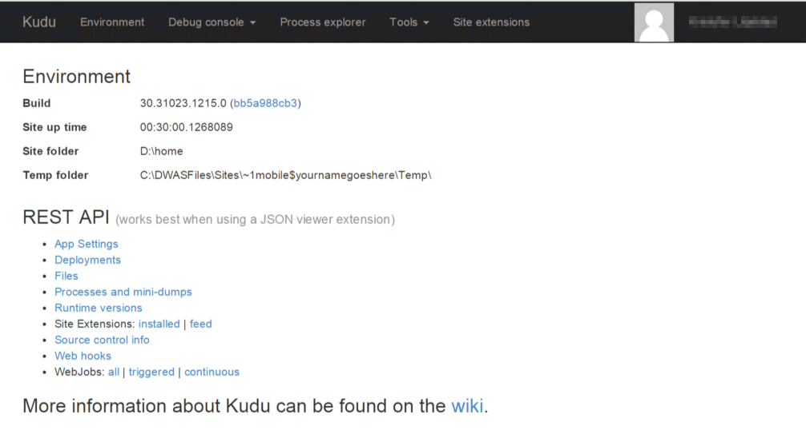

Uploading structured data to Azure Table Storage
================================================
Microsoft Azure provides several services that makes great sense to use directly from your Tessel device. Creating custom APIs using Mobile Services, Azure Websites or Virtual Machines might be the first you think about, but several other services could be used on their own or together with those custom APIs. Azure Table Storage is a NoSQL Database hosted in Azure for you, designed to handle massive amount of structured data and load. Having your clients make direct calls to Azure Table Storage will offload your other services. While offloading other services, you will have to do other tradeoffs instead. Since the clients are writing data directly to Azure Table Storage, you lose some of the control of the data that get pushed to your service and you have to handle that in other ways, like using an asynchronous pattern to validate and clean up data. Still, if storing structured data is what you are looking to do, then you should definitively consider Azure Table Storage and this lab will give you a taste of it.

During this lab you’ll build a (fake) weather monitor device that registers and sends temperature and humidity information to the cloud.

Prerequisites
-------------
In order to successfully complete this lab you need to:

* Have successfully setup your Azure Subscription, your development environment and your Tessel according to instructions outlined in the [Setup Lab](../_setup).
* Optional: It's not necessary but the lab [Creating and Calling a Custom REST API with Azure Mobile Services](../mobile-services) will provide additional information about how you can create and host a custom RESTful Web API on Azure Mobile Services. Doing that lab before this one might be beneficial and shows other way of working with Mobile Services than what is used in this lab.

Instructions
------------
Azure Table is one of the services in the overall service called Azure Storage. By default Azure Table is secured and you can't access it without the storage account name and key. The storage account name should be considered public knowledge, but the storage account key should be handled with extreme care and is something you shouldn't share with any external clients. If you do get your hand on a valid storage account name and key you are in fact administrator of that storage account and can create, ready, update and delete tables and data stored in the tables. In fact since you with those credential have full administrative rights to the storage account you can also execute requests against the other services included in Azure Storage, such as Blobs, Queues and Files. So handing out the storage account key to any client that are not under your direct control is an extremely important “Anti Pattern” (something you shouldn’t do) to know about.

So if we shouldn’t give away the storage account key, how can we then have external clients access services within a Storage Account?

The good news is that you can use a technique that is called: [Shared Access Signature, SAS](http://azure.microsoft.com/en-us/documentation/articles/storage-dotnet-shared-access-signature-part-1/). With SAS you can give out temporary usage rights to different resources in a Storage Account. For example, you can generate a SAS that gives a client temporary rights to create, read, update or delete data in a specific table in Azure Tables. Sounds all good, right? The problem here is that you need the storage account name and key in order to generate the SAS, hence it has to be generated at a safe and controlled location such as in a service controlled by you.

### Execution flow

In this lab we’re going to host a small service on Microsoft Azure Mobile Services that will provide your tessel with configuration and a Shared Access Signature that in turn will grant the Tessel with the ability to write/add rows directly to Azure Table Storage.

1. Tessel calls API to retrieve configuration and SAS
2. SAS is saved locally on the Tessel device and is used for several writes directly against Azure Table Storage
3. After a configurable amount of measurements, the Tessel will once again call the API to retrieve new configuration and a new SAS before the old one times out. This gives us control of the tessel and also control over our storage account since we could invalidate the SAS for a particular device quite easy.

### Setting up Azure

There are two components we need to setup in Azure to have everything working: storage and hosting.

#### Create a storage account

During this part of the lab we are going to use the Azure-CLI (Azure x-Plat Tools), even though you can easily do the same thing using the management portal if you want to.

Open a terminal/console windows. Execute the following commands to gain some insights into what we are trying to do next.

	azure storage account -–help
	azure storage account create --help

When you are ready, execute the following command to create a new storage account. Replace <name> with a globally unique name that you want to use. The command will fail if the name is already taken, so chose something creative or just try again until you find something unique. You can also change the location to whatever datacenter you feel like using. Often the recommendation is to put your storage account in the same datacenter as your other services in order to reduce lag and expenses related to data transfers between datacenters, but in this lab you can chose whatever location you feel appropriate.

	azure storage account create –location “North Europe” <name>

If everything is successful you should now have a new storage account created. Remember the name you used and use it whenever we refer to the name of your storage account. In order to access that storage account we need to retrieve the storage account key. Execute the following command to retrieve the keys.

	azure storage account keys list –help
	azure storage account keys list <name>

Sample output

	PS C:\dev\tessel-azure-labs> azure storage account keys list yournamegoeshere
	info:    Executing command storage account keys list
	+ Getting storage account keys
	data:    Primary ZF2po8rCJk.....DATA-REMOVED-FROM-SAMPLE....4rrt5EN2lK1k2hA==
	data:    Secondary lo+nGo/W.....DATA-REMOVED-FROM-SAMPLE....Pt1orNXRnJjZA7g2w==
	info:    storage account keys list command OK

These keys can only be accessed if you are administrator of the Azure Subscription that hosts the particular Storage Account and those keys should be handled with care. Don’t give them away to anyone you don’t trust and don’t save them on uncontrolled devices or clients. With any of these keys you have full control over that specific storage account. Copy and save the primary key to somewhere safe on your computer for now, we’ll be using it soon again. You can always retrieve the keys again later by executing the same command or though visiting the management portal. If you need to you can also create new keys, but that will invalidate any other keys already out there.

Throughout this lab we’ll be calling into this Storage Account through some tools and mane of those tools (including Azure-CLI) accepts they name and key of your storage account as input parameters, but they also accept them saved in Environment Variables. The process of saving values in Environment Variables differs some through different operating systems and terminal/command windows/shells. Here are some examples and if you are using another operating system or shell, please search the Internet for information about how to set Environment Variables. Setting environment variables according to this will not persist your changes so if you open a new terminal/command window, restart your computer, etc. your information will be forgotten:

	// Windows - Command Prompt
	> set <name> = <value>

	// Windows – PowerShell
	> $env:<name> = <value>

	// OS X (Mac) - Terminal
	> export <name> = <value>

	// Linux - Bash
	> export <name> = <value>

Set the Environment Variables: AZURE_STORAGE_ACCOUNT and AZURE_STORAGE_ACCESS_KEY to the name of your storage account and the access key to that storage account respectively.

	// Windows – Command Prompt
	> set AZURE_STORAGE_ACCOUNT = <storage-account>
	> set AZURE_STORAGE_ACCESS_KEY = <key>

	// Windows – PowerShell
	> $env:AZURE_STORAGE_ACCOUNT = <storage-account>
	> $env:AZURE_STORAGE_ACCESS_KEY = <key>

	// OS X / Linux
	> export AZURE_STORAGE_ACCOUNT = <storage-account>
	> export AZURE_STORAGE_ACCESS_KEY = <key>

If you by any reason don't succeed or don't want to set the Environment Variables you can also add the storage account name and key manually wherever that is needed, but from now on this lab description assumes the storage account name and key are set.

#### Create and test table in Azure Table Storage

Azure Table Storage is one of several sub storage systems in Azure Storage. In order to have the Tessel write directly to a table in the storage system we will pre-create the table and also introduce a small sample tool to read and write some test data from that table.

Open a terminal/console window. Make sure you have downloaded/cloned/copied the contents of this lab locally on your computer and change directory to the "tool" directory.

	cd tool

In this directory you'll fine a Node.js app ([app.js](tool/app.js)). We are going to use this app, but first we need to install required Node Modules. The required Node Modules for this project are described in the [package.json](tool/package.json) file and Node.js provides an easy tool for downloading and installing those dependencies. Install the required module(s) by executing the following command

	npm install

If everything went according to plans you should now be able to execute the following command

	> node wt

	Weather Tool, WT
	  for lab: UPLOADING STRUCTURED DATA TO AZURE TABLE STORAGE

	usage: node wt <create | insert | read | clear | delete> [azureStorageAccount] [azureStorageAccessKey]

	Azure storage access need to be provided as parameters or through the following environment
	variables. Look-up how you set Environment Variables for your operating system or pass in
	the credentials as parameters

	Currently using:
	  AZURE_STORAGE_ACCOUNT    : yournamegoeshere
	  AZURE_STORAGE_ACCESS_KEY : ZF2po8rCJk.....DATA-REMOVED-FROM-SAMPLE....4rrt5EN2lK1k2hA==

We will use this tool during the rest of this lab to:

* create table 'weatherlogs'
* insert sample data in table 'weatherlogs'
* read data from table 'weatherlogs'
* clear data from table 'weatherlogs'
* delete table 'weatherlogs' and all data within when we are done

If you have successfully set the Environment Variables AZURE_STORAGE_ACCOUNT and AZURE_STORAGE_ACCESS_KEY the values will be shown by the tool. If not, you can provide those parameters to this tool manually according to the shown syntax.

Execute the following command to create a new Azure Table in your currently referenced storage account:

	> node wt create

By now you should have an empty table created in your storage account. By know you could start any other program that have access to this table and start reading and writing data to it. But before we continue we shall try out the table somewhat first. Execute:

	> node wt insert

	Insert sample data in table

	PartitionKey      :  TM-00-04-f000da30-0061473d-36582586|20141110
	RowKey            :  82576
	Temperature       :  34
	Humidity          :  27
	Sample Weather Log inserted successfully in table weatherlogs

A sample weather log has now been inserted into the table and you can see the properties that was selected for you. Execute the same command several times and you'll have several rows inserted into your table. Insert approximately 10 rows before you continue. 

Now it's time to read data from our table. Execute the following command to have the Weather Tool connect to your table and retrieve the top 50 rows.

	> node wt read

	Reading top 50 rows from table

	PartitionKey                                    RowKey  Temperature     Humidity

	TM-00-04-f000da30-0061473d-36582586|20141110    82371   -9              83
	TM-00-04-f000da30-0061473d-36582586|20141110    82372   19              82
	TM-00-04-f000da30-0061473d-36582586|20141110    82373   3               13
	...
	...
	...
	TM-00-04-f000da30-0061473d-36582586|20141110    82374   41              35
	TM-00-04-f000da30-0061473d-36582586|20141110    82376   -15             77
	TM-00-04-f000da30-0061473d-36582586|20141110    82576   34              27	

Examine the values and then delete them all by executing:

	> node wt clear
	......

	Table is empty!

You can check that your table is empty if you want to, by once again executing the read-command as above. There is also one last command to execute 'node wt delete', but that command will remove the table completely and make it impossible for our devices to write to it, so don't execute that command until you are ready with the lab and want to remove all data and the table itself.

##### Small note about PartitionKey and RowKey

As you might have seen above when we inserted and read the rows from our Azure Table, all rows had a property called PartitionKey and another one called RowKey. These keys are fully selectable by the user, i.e. you, so they could have been any valid string. The important things to remember when selecting your Partition and Row Key is:

* PartitionKey and RowKey together forms an table unique identifier that identifies one row. I.e. you can't have two rows with the same pair of PartitionKey and RowKey.
* Azure Table Storage uses PartitionKey to understand what data that need to be stored close together and what data can be partitioned across boundaries like machines. This all takes place behind the scene but rows with different PartitionKeys can be stored on different machines even though it's saved in the same table.
* Data saved with the same PartitionKey can easily be fetched all at once, while data with different PartitionKeys might need several API Calls in order to get.
* Partition and Row Key are very important for sorting and querying of data. You want to minimize the times where you create queries that involves other properties than those two, since any other queries will involve some kind of 'scan' that will take longer time.
* You want to select a PartitionKey that is a specific as possible for your solution in order to gain scalability and speed.

There are more things to know about the PartitionKey and RowKey than we can handle in this lab, but with a carefully selected algorithm for your keys, Azure Table Storage will be a fast and scalable data storage alternative.

In our sample we have created a PartitionKey that is constructed like this:

	[TesselSerialNo] + | + [year] + [month] + [day]

And a RowKey that is created by calculating the number of seconds left during the day.

	secondsPerDay = 24*60*60
	secondsLeftToday = secondsPerDay - secondsSinceMidnight
	rowKey = padLeft(secondsLeftToday, 5) // Fill out with zeros

This pair of PartitionKey and RowKey will give you a table where you never will have to large partitions since every device will have a new PartitionKey for each day. Still the partitions will be large enough so we can do simple things like: collecting all data for a specific tessel, for a specific date and return all data at once.

There are books and tutorial about how to select good PartitionKeys and RowKeys, make sure you select them with consideration before you implement your solutions.

#### Create and host the SAS Service

As we talked about before, we need a controlled place where we create and hand out the SAS that will be used for direct access against Azure Table Storage, so we’ll start by creating that service.

There are several choices where you can host services in Microsoft Azure, such as:

* Mobile Services
* Websites
* WebRoles
* Virtual Machines
	* Windows
	* Linux
* App container, such as Dockers
* etc.

During this lab we will build simple REST API with Node.js and host it in Mobile Services. And if it wasn’t enough with alternatives, there are also plenty of deployment alternatives when it comes to Mobile Services, such as:

* Manually through the [Management Portal](http://manage.windowsazure.com)
* Through Azure-CLI (Azure x-Plat Tools) (The lab “[Creating and Calling a Custom REST API with Azure Mobile Services](../mobile-services)” uses this approach)
* Through Git
* Automatically through integration with a build server, like [Visual Studio Online](http://visualstudio.com)

We will be using the portal to setup our Mobile Service manually this time.

##### Create your Mobile Service

Start by login on to the Microsoft Azure portal at [http://manage.windowsazure.com](http://manage.windowsazure.com) and then press the "New +" button in the bottom left corner and select:

Go through the wizard and create your mobile service:

* Database: Create a free database, select an existing SQL database or whatever alternative you find best for you. We will not be using the database during this lab at all.
* Region: Make sure you select a region you want to use for hosting your service.
* Backend: Select JavaScript for this lab.
* There is no need to configure advanced push settings

* Database settings: Depending on what you selected as alternative for database you will need to provide information on how to contact your database. If you selected to create a new database that would be new login information, while if you selected to connect with an existing database that would be already existing user and password. We will not be using the database during this lab at all, but the creation of a Mobile Service still require us to enter that information.

Wait for your Mobile Service to be created then click on the name to open it up for more information.

If you run into trouble look for more information at the official [Microsoft Azure Website](http://azure.com)

##### Create and host a custom REST API in Mobile Services

While having your MobileService open in the browser navigate to the "API tab" of your service and click the "+ CREATE" button at the bottom of the page.

In the next dialog select

* API NAME: weatherconfig
* GET PERMISSION: Everyone
* POST PERMISSION: Only Administrators
* PUT PERMISSION: Only Administrators
* PATCH PERMISSION: Only Administrators
* DELETE PERMISSION: Only Administrators

Create the API and wait for it to be available. Those settings will create a custom RESTful API where everyone (unauthorized) will be able to execute POST Requests against that endpoint. The other verbs will be shut off for everyone but you as an administrator.

Click on the nme of the API you just created to see some sample code that was created for you.

	exports.post = function(request, response) {
	    // Use "request.service" to access features of your mobile service, e.g.:
	    //   var tables = request.service.tables;
	    //   var push = request.service.push;

	    response.send(statusCodes.OK, { message : 'Hello World!' });
	};

	exports.get = function(request, response) {
	    response.send(statusCodes.OK, { message : 'Hello World!' });
	};

Let's try that sample code by browsing in a new window to the following URL:

	https://[yournamegoeshere].azure-mobile.net/api/weatherconfig

Replace [yournamegoeshere] with the name of your Mobile Service that you just have created and you'll be created by:

	{"message":"Hello World!"}

So we do got an existing RESTful API hosted in Mobile Services, now we just want it to deliver the services that we want it to do. Time to replace that code with more custom code. In the file [weatherconfig.js](mobile-services/api/weatherconfig.js) you'll find the complete implementation of the code we want to use.

* Open [weatherconfig.js](mobile-services/api/weatherconfig.js) and copy the contents
* Replace the sample code in your "weatherconfig" API with the provided code
* Save your changes by pushing the "SAVE" button at the bottom.

If you once again try to access the URL:

	https://[yournamegoeshere].azure-mobile.net/api/weatherconfig

... you'll get an "Internal Server Error". Now why is that? Let's find out.

At the top of the custom code you'll see that our Node.js code references a module called 'azure-storage'.

	var azure = require('azure-storage');

That module includes very useful functions for working with Azure Storage and we would like to use that library. Unfortunately for us, that Node.js library is not installed on the server where we host our Mobile Service. The good thing is that we can both confirm that this is the case and we can also fix the problem.

Use the back button on the management portal web page, NOT THE BROWSERS BACK BUTTON, to get up one step in the hierarchy. Then click on the LOGS section of your Mobile Service.

As you can see here you probably have at least two errors. Select the one on the bottom and click the "DETAILS" button to see more information about that log post.

	Log entry details

	ERROR
	Failed to load script file 'weatherconfig.js': Error: Cannot find module 'azure-storage'
	    [external code]
	    at Object.<anonymous> (D:\home\site\wwwroot\App_Data\config\scripts\api\weatherconfig.js:1:75)
	    [external code]

So we did have right, Azure Mobile Services doesn't have the module 'azure-storage' installed so it can't be found. So we need to install it.

##### Install your custom Node.js modules in Azure Mobile Services

Both Azure Mobile Services and Azure Web Sites comes with a quite well hidden feature called Site Control Manager, SCM or sometimes known by the internal code name, Kudu. You can access your Mobile Services' SCM by browsing to the following url:

	https://[yournamegoeshere].scm.azure-mobile.net

If you do that from the same browser where you are logged in to the Azure Management portal, you'll be directly logged on so don't be alarmed and think that everyone can access your site's or service's SCM, it's only the ones that are administrator of that Azure Subscription.

Browse around in the Site Control Manager/Kudu interface some and then stop at "Debug console->PowerShell". Through this feature you'll be able to execute commands remotely on your Virtual Machine that hosts your Mobile Service. Neat, right?

	Kudu Remote Execution Console
	Type 'exit' then hit 'enter' to get a new powershell process.
	Type 'cls' to clear the console

	PS D:\home>  

Execute the following commands:

	PS D:\home> cd site\wwwroot\app_data\config\scripts\
	PS D:\home\site\wwwroot\app_data\config\scripts>npm install --save azure-storage

This will install the missing package and save information in the package.json file about it. Once that is successful (don't be scared of the red text that might show up on your display) it's time to try and access the service once again. Hint: it wont work this time either, but let's do it anyway. Browse to:

	https://[yournamegoeshere].azure-mobile.net/api/weatherconfig

... and once again go back to Azure Management portal and look at the logs for your Mobile Services. You might have to press the "REFRESH" button on the bottom of the page to have the new logs show up. Logs higher up are newer logs, so let's look at details for some of them until you find something like this:

	Failed to load script file 'weatherconfig.js': Error: Credentials must be provided when creating a service client.
	    [external code]
	    at Object.<anonymous> (D:\home\site\wwwroot\App_Data\config\scripts\api\weatherconfig.js:2:22)
	    [external code]

The good thing here is that we don't have any errors saying we are missing a module anymore, so let's find out what this is. On row 2 in the weather API file, we are creating a TableService object that will act as a client for us to execute commands against tables.

	var tableSvc = azure.createTableService();

This is the line that fails right now. The reason is that we don't provide any credentials to our storage account and if we don't then the Azure Storage Module assumes that those credentials should be past in as Environment Variables. Once again the good thing is that those parametrars are really easy to set in the portal.

Go back one step (you know with the back button in the portal, not the browsers back button) and then go to the "CONFIGURE" section for your Mobile Service. Scroll down until you can see the section named "app settings". This is where you can create your Environment Variables and it happens to be that these variables is exactly the same as the once you used in the beginning of this lab. I guess you don't remember the key anymore, but open up your terminal/command window and execute the following Azure CLI command once again, where <name> is the name of your storage account that you created before.

	azure storage account keys list <name>

Copy one of the keys (anyone is ok to use) and create the following App Settings:

* AZURE_STORAGE_ACCOUNT
* AZURE_STORAGE_ACCESS_KEY

... and set them to the correct values. When you are done, save your changes with the "SAVE" button at the bottom of the page.

Once again browse to:

	https://[yournamegoeshere].azure-mobile.net/api/weatherconfig

... and if everything now is setup according to plans, you will get another JSON response that tells you:

	{"authorized":false,"message":"deviceId was not provided or has been refused access"}

This is in fact a custom error message and this message actually tells us that everything works just fine. In order to get a response back from our server we just need to identify ourselves by appending a deviceId at the end of the URL. Change the URL and browse to the following instead:

	https://[yournamegoeshere].azure-mobile.net/api/weatherconfig?deviceId=123-123-123

Once again we want to tell you, that this is NOT a fully tested, super secure, authentication implementation. As you can see you can very easy change the deviceId to whatever you want and you'll get a result. There are information out on the internet on how you should handle authentication from devices, this is not one of them, but this lab shows you how to use Azure Tables together with a service that gives out Signed Access Signatures (and other configuration) in order to avoid handing over the storage account keys. You've been warned before, but now we've told you again.

You won't get exactly the same result as shown here but something similar:

	{
		"authorized":true,
		"refreshConfigAfterNo":3,
		"delayBetweenMeasurements":10000,
		"azureStorageAccount":"tesselazure",
		"tableName":"weatherlogs",
		"sas":"se=2014-11-10T03%3A23%3A05Z&sp=a&sv=2014-02-14&tn=weatherlogs&sig=np%2Fv26%2B2lW1JDQ2hxdlhTfNKIDvIcVR0lqH0dvLPv54%3D"
	}

We have our service up and running and it has just returned information to our client about where the client/device should write weatherlogs, how often the Tessel should look for updated configuration, how long delays there should be between measurements and how the client should authenticate by using a Signed Access Signature, SAS. This kind of approach gives us:

* the flexibility to deny access to specific deviceIds
* reconfigure the devices from the server side
* handle scaling by returning different storage accounts and/or tables for different devices

Take some minutes to play around with the service and look at the code you've just deployed.

#### Connect your tessel to Azure Table Storage

Now that we have all backend services up and running it's time to connect our Tessel to those services. There is already a finished application in the [tessel folder](tessel), that we are going to use.

Open a terminal/command window and make sure you have a connection to your Tessel by running:

	> tessel blink

Press Ctrl-C when you have seen enough blinking LEDs. Change directory to the provided [tessel folder](tessel):

	> cd tessel

If you are not currently in the lab directory you have to change directory to that dir first. There is a small configuration change you'll need to do in that file before you continue, so open the file: weatherdevice.js locally on your computer and find the following rows:

	// REPLACE yournamegoeshere WITH THE NAME OF YOUR AZURE MOBILE SERVICE
	// WARNING: THIS IS NOT NECESSARY THE SAME NAME AS YOUR STORAGE ACCOUNT
	
	var apiUrl = "https://yournamegoeshere.azure-mobile.net/api/weatherconfig";

Replace the part of the URL with the name of your Mobile Service's name. Save the file and execute the following command:

	> tessel run weatherdevice.js

If everything works, your Tessel will now:

1. Connect to your Mobile Service to retrieve configuration and a Signed Access Signature. Your Tessel will signal this phase with the green LED.
2. With the provided configuration, the Tessel will now turn it's attention towards Azure Storage and the configured table in there. After collecting weather logs (fake ones in this lab), the Tessel will directly call Azure Table Storage and add a row for the current measurement. This phase is signaled by the blue LED.
3. After waiting for a while, the Tessel will do one of two things: Collect more weather logs or ask for new configuration settings. Remember that the Signed Access Signature is valid for a longer time, so the Tessel can write several logs against Azure Tables before a new SAS is needed.

Open a new terminal/console window and change directory to the [tool folder](tool). Remember the tool we used to create and insert sample into the Azure Table we are using. Use that same tool to watch incoming logs from your Tessel by running:

	> node wt read

Play around with the server side code as well as the Tessel code and make sure you understand the flow.

### Challenges

* Use several Tessel devices and have them connect to the same Mobile Service. Update the code on the server side so that each of the connecting Tessel devices get different storage accounts to connect to.
* Implement a solution where you can ban specific Tessel Devices if they get too aggressive with uploading data.
* Implement a service that returns the average temperature per device and day

Summary
-------

During this lab you've created a service, hosted on Azure Mobile Services, that provides configuration and authentication to the Tessel. With that information the Tessel is then capable of directly connecting to Azure Table Storage to deliver structured data that we later on can read and use from both clients and servers. By accessing Azure Tables directly we offload very much of the traffic that otherwise would have to go through your own custom API. We’ve also shown that with the correct keys, Azure Table Storage can be an optimal solution to your ever growing storage needs if it’s structured data we are talking about.

